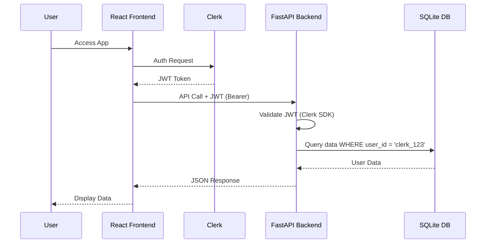
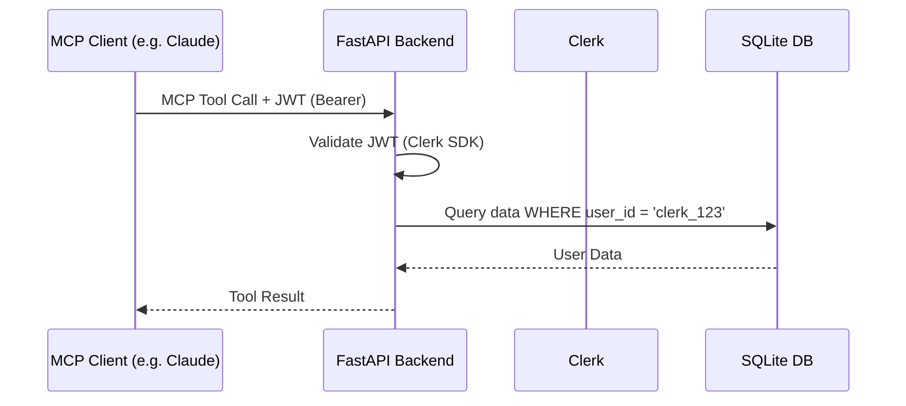

# Multi-tenant Authentication Plan

## 1. Authentication Strategy: Clerk
**Why Clerk?**
- **Speed**: Handles all auth UI and backend logic.
- **Features**: Built-in social login (Google/GitHub), MFA, and session management.
- **Security**: Professional-grade security with regular audits.
- **AWS Compatibility**: Works perfectly well on AWS infrastructure as an external provider.

## 2. Authentication Flow

### Web UI (Frontend)
- Use `@clerk/clerk-react` to wrap the SPA.
- Protect routes using `<SignedIn>` and `<SignedOut>` components.
- Use `useAuth()` hook to get JWT tokens for API calls.

### REST API (Backend)
- Add `clerk-sdk-python` to backend dependencies.
- Implement a FastAPI dependency/middleware that validates the Clerk JWT.
- Extract `user_id` from the validated token.

### MCP Server (HTTP)
- The MCP HTTP endpoint will be protected by the same Clerk JWT validation.
- MCP clients (like Claude) must provide the Clerk JWT in the `Authorization: Bearer` header.
- *Challenge*: Getting a long-lived token for MCP clients. Clerk supports "API Keys" for organizations, but for individual users, we may need a dedicated "API Key" system within Persona or use Clerk's session tokens if the client can refresh them.

## 3. Database Schema Changes (v3 Migration)
All user-owned data must be tagged with a `user_id`.

### resume_version
- Add `user_id TEXT NOT NULL`
- Update `idx_resume_version_default` to be `(user_id, is_default)`

### application
- Add `user_id TEXT NOT NULL`

### idx_application_updated
- Include `user_id` for efficient per-user sorting.

## 4. API & Service Changes
- All `ResumeService` and `ApplicationService` methods will now require a `user_id` parameter.
- `DBConnection` remains shared, but all queries will include `WHERE user_id = ?`.

## 5. Mermaid Diagram: Auth Flow

## 6. Mermaid Diagram: MCP Auth Flow

